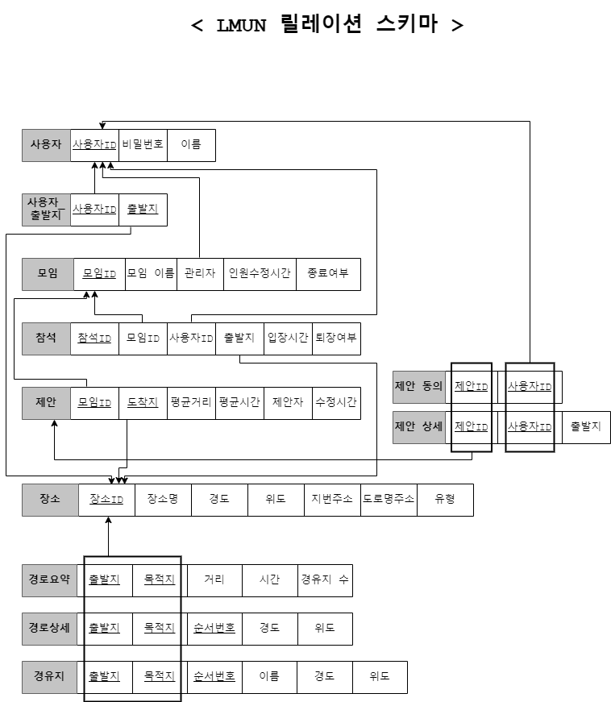

## 모임 장소 추천 웹 어플리케이션

### 요구 사항 및 프로세스
1. 모임을 생성하면 고유 문자열로 식별되는 URL을 할당한다.
2. 모임은 모임 날짜 1일 후 삭제된다.
3. 생성된 URL을 통해 나머지 참가 인원이 접속할 수 있다.
4. 장소가 확정된 이후에는 더이상 참가할 수 없다.
5. 참가자는 회원 또는 비회원이다.
6. 각 참가자는 자신의 출발지를 입력한다.(단, 각 인원은 하나의 출발지만 입력하도록 제한되어야 한다.)
7. 각 참가자는 추천 장소를 바로 확인할 수 있다.
8. 확정된 장소에 대해 각 경로와 소요시간을 확인할 수 있다.

---

### E-R Schema

***

### 릴레이션 스키마

### 문서로 이동
* [시나리오. ](https://github.com/jsjg73/LMUN_Ver2.1/blob/4d51b994f1b1aad8fd2005a91cb314be7b3e30fe/documents/%EC%8B%9C%EB%82%98%EB%A6%AC%EC%98%A4.txt)