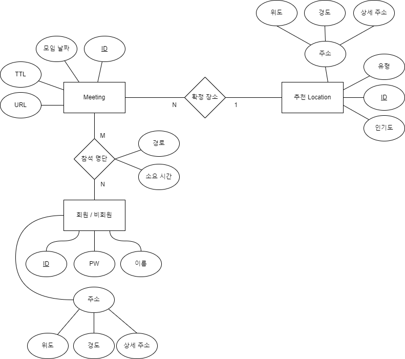

## 모임 장소 추천 웹 어플리케이션

### 요구 사항 및 프로세스
1. 각 모임은 고유 URL이 존재한다.
2. 생성된 URL을 통해 나머지 참가 인원이 접속할 수 있다.
3. 장소가 확정된 이후에는 더이상 참가할 수 없다.
4. 참가자는 회원 또는 비회원이다.
5. 각 참가자는 자신의 출발지를 입력한다.(단, 각 인원은 하나의 출발지만 입력하도록 제한되어야 한다.)
6. 각 참가자는 추천 장소를 바로 확인할 수 있다.
7. 확정된 장소에 대해 각 경로와 소요시간을 확인할 수 있다.

---

### E-R Schema

***

### DB 선택 고려사항
- nosql mongoDB 선택
  - 회원, 비회원을 동시에 다룰 수 있는 스케마 필요
  - 모임 날짜 이후 자동으로 제거 될 수 있도록 TTL 지원 필요
  - 추천 장소를 검색하는데 geospatial query(near query) 지원 필요
