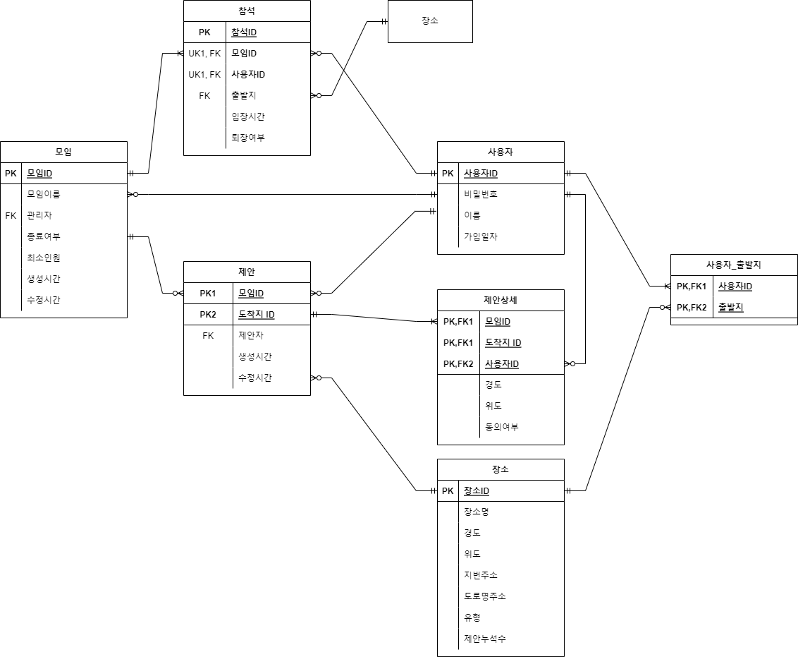

## 모임 장소 추천 웹 어플리케이션

---
### 프로젝트 개요
1. 프로젝트 명 : Let's Meet Up Now 2.1 (LMUN v2.1) - 우리 지금 만나

    1.1 프로젝트 기간 : 2021-12-21 ~ 2022-02-21

    1.2 목적 : 
    - 인기있는 모임 장소 DB 구축.
    - 합리적인 모임 장소 추천
    - 추천 장소의 주변 정보 제공.
    - 추천 장소 까지의 이동 경로, 거리 및 소요 시간 정보 제공.

    1.3기대효과 :
    - 합리적인 모임 장소 선택 지원으로 의사결정 비용 감소
    - 항상 가던 장소가 아닌 새로운 장소를 선택할 근거 제시.

---
### [시나리오](documents/시나리오.txt))
1. 모임 시나리오

    1.1 생성 시나리오

    1.2 입장 시나리오

    1.3 참석자 출발지 변경 시나리오

    1.4 추천 지역 검색 시나리오

    1.5 제안 지역 상세 보기 시나리오

    1.6 퇴장 시나리오

    1.7 삭제 시나리오

2. 회원 시나리오

    2.1 회원 계정 시나리오

    2.2 비회원 계정 시나리오

---
### 릴레이션 스키마

---
### E-R 다이어그램

---
